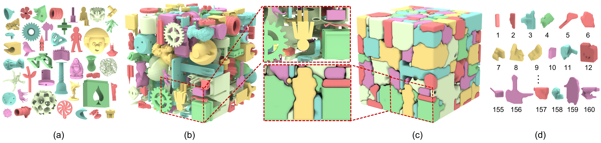

# Chapper: Carvable Hull-and-Pack for Subtractive Manufacturing[[Project page](https://zmzhang0.github.io/projects/Chapper/index.html)]

> SIGGRAPH Asia 2025 (Journal Track, ACM Transactions on Graphics)

Chapper framework achieves compact packing with high space utilization while ensuring all objects satisfy the carvable constraints. We introduce a novel carving hull extraction method that computes a carving hull for each object, capturing both its shape and subtractive manufacturability, constrained by neighboring geometry and encoding machining paths. This figure illustrates our method packing 160 complex benchmark objects (a) densely into a cube (b) with 21.6 % space utilization. It also produces a disassembly sequence (d) and corresponding carving hulls (c). Each object is fully enclosed by its carving hull, which guides toolpath generation and enables feasible disassembly.

## 📁Project Structure

| Directory   | Description                          |
| :---------- | :----------------------------------- |
| include/    | Core headers & main implementation   |
| src/        | Main source code                     |
| VBM/        | Visibility-based Marching (modified) |
| CUDA_VOXEL/ | GPU-accelerated voxelization&#x20;   |
| data/       | The cutter model and packing models  |
| output/     | The packing results                  |

## 🔧 Requirements (recommended)

* GPU: NVIDIA GPU

* CUDA: 12.6

* Visual Studio: 2022

## 📦 Dependencies

The following libraries are required (included in /package):

| Library  | Version | Usage                  |
| :------- | :------ | :--------------------- |
| CGAL     | 5.6.1   | Computational geometry |
| libigl   | 2.5.0   | Geometry processing    |
| SFML     | 2.6.1   | Visualization / IO     |
| trimesh2 | -       | Mesh processing        |
| gco-v3.0 | -       | Graph-cut optimization |

This project is written in C++. Prior to compiling it, you should install all dependencies and include all relevant code files.

## License

All rights about the program are reserved by the authors of this project. The programs can only be used for research purpose. In no event shall the author be liable to any party for direct, indirect, special, incidental, or consequential damage arising out of the use of this program.
